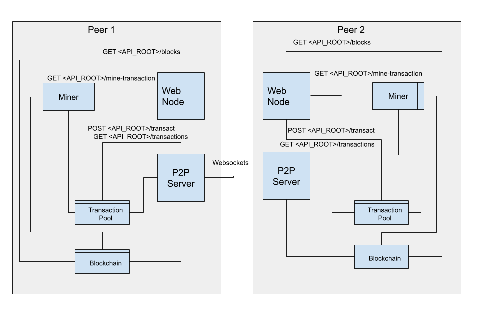

# TYPCOIN
A prototypical crypto-currency implementation

[](https://travis-ci.com/soumik-uxd/typcoin)

Please note this is still a very much work in progress, but has the potential to be a decent decentralized cryptocurrency implementation which can also be repurposed with some minor changes to work as a distibuted ledger.
This was primarily created as a demonstration project to augment my self-study of blockchain topics.

This project currently has below topics:
- A Blockchain (duh!)
- Wallets
- P2P transaction via websockets.
- Transaction pool
- Miners
- Various API endpoints
- A proof of work algorithm which has varying difficulty logic to facilitate a pre-configured mine rate.
- A bunch of tests to check all major functionalities (written in jest).

### Dependencies
- Bodyparser & Express
- Elliptic & CryptoJS
- UUID
- web sockets

### Dev-dependencies
- Nodemon
- Jest
- Eslint

## Architecture



The above diagram explains the basic anatomy of every peer node, connected in the P2P network which allows the peers to transact among each other. The connection between every peer is made via websockets. The web node is used only to perform GET/POST requests for every peer. When a transaction is made it sits in the transaction pool of every peer. Then any of the miners needs to be requested to mine/verify the transactions. Once a transaction is mined it is taken out of the transaction pool and added into the blockchain.

## How To

Clone the repository
```bash 
git clone repo
cd repo_dir
```

Install all required dependencies
```bash 
npm install
```

Invoke test suite
```bash
npm run test
```

Create first peer app instance:
```bash
npm run dev
```

This will create an app instance running on `http://localhost:3001` and a P2P server instance running on `ws://localhost:5001`. 

Create second peer app instance:
```bash
HTTP_PORT=3002 P2P_PORT=5002 PEERS=ws://localhost:5001 npm run dev
```
This will create an app instance running on `http://localhost:3001` and a P2P server instance running on `ws://localhost:5001`. 

Create third(and more) peer app instance:
```bash
HTTP_PORT=3003 P2P_PORT=5003 PEERS=ws://localhost:5001,ws://localhost:5002  npm run dev
```

As you can see with every new peer instance the PEERS comma delimited string needs to be updated with previous instances. Not very practical but this method will be soon oevrriden in the future with a containerized solution.

Now various api endpoints on the app instances can be invoked with GET/POST requests.

These are described below:

|Path               | Type          |Description|
|-------------------|---------------|-----------|
|/public-key        |GET            |Public key of the peer|
|/transact          |POST           |Create a transaction|
|/transactions      |GET            |List current unconfirmed transactions|
|/mine-transaction  |GET            |Mine current unconfirmed transactions from the pool|
|/blocks            |GET            |View the confirmed transactions in the blockchain|

## Demo
Here we will set up three peers. Every peer starts with an amount of 500 coins in their wallet. Then one peer will transfer some money to the 2nd peer. The third peer then mines the transaction thereby validating it.

Once atleast three app instances are running,transaction(s) can be first established between peers, and then the third peer can be used as a miner to verify the transaction(s), and add to the blockchain.

So we do a GET request on the 2nd peer instance with endpoint `http://localhost:3002/public-key`.

```JSON
{
    "publicKey": "0489ceddcab489be53191402159c4f48d752a4e7f2faedb82a3face6bb80793fdea66171c6cd8e5e321f4946b79c3f76bac861946d23f47bd789bed04ebbbc1e53"
}
```

From the first peer then we create a transaction for the second peer using the endpoint `http://localhost:3001/transact` by POSTing below JSON.
```JSON
{
	"recipient": "0489ceddcab489be53191402159c4f48d752a4e7f2faedb82a3face6bb80793fdea66171c6cd8e5e321f4946b79c3f76bac861946d23f47bd789bed04ebbbc1e53",
	"amount": 50
}
```
The output redirects to the `/transactions` endpoint to reveal the yet unconfirmed transactions in the transaction pool.
```JSON
[
    {
        "id": "60092570-b5cf-11e8-8803-5fff09999f01",
        "input": {
            "timestamp": 1536676290887,
            "amount": 500,
            "address": "0467e6c4396fbcbb18bf418d676011abd81e83df91a4d60f506afc2836391abb70d158e19999fb514f325e120a271af0f33c2351e48995ac83c1535fb61a76781a",
            "signature": {
                "r": "718f814456f63da36f36966697f471cb4f9d1f80b3d192195adc3d1b133168ec",
                "s": "3496d41700b08f94b428ecbe27b931ceb7eaa2fa5e614347f1954943664ef2e3",
                "recoveryParam": 0
            }
        },
        "outputs": [
            {
                "amount": 450,
                "address": "0467e6c4396fbcbb18bf418d676011abd81e83df91a4d60f506afc2836391abb70d158e19999fb514f325e120a271af0f33c2351e48995ac83c1535fb61a76781a"
            },
            {
                "amount": 50,
                "address": "0489ceddcab489be53191402159c4f48d752a4e7f2faedb82a3face6bb80793fdea66171c6cd8e5e321f4946b79c3f76bac861946d23f47bd789bed04ebbbc1e53"
            }
        ]
    }
]
```
Then to confirm the transactions we mine the transaction block(s) via the endpoint `localhost:3003/mine-transactions`. After the mine is complete the output is redirected to the `/blocks` endpoint where the blockchain can be seen.
```JSON
[
   {
       "timestamp": "0",
       "lastHash": "0",
       "hash": "0000",
       "data": [],
       "nonce": 0,
       "difficulty": 3
   },
   {
       "timestamp": 1536676521089,
       "lastHash": "0000",
       "hash": "001ae62d361ffb44a39d0286c8e405bf9c737b040bcd3bcf2d47c2f4f91c63ec",
       "data": [
           {
               "id": "e93a4d10-b5cf-11e8-94f3-59c2b00a9f6d",
               "input": {
                   "timestamp": 1536676521057,
                   "amount": 500,
                   "address": "046856356d2bf900a062682d007004dff3a1539ea7aee4400013f7645dc2b062c1250707698cf4ba4d3f5ee9591ba29f93a628aba0eb7ecc851f47ffa2ceef569d",
                   "signature": {
                       "r": "468112fe9442d21ed5218cb8c9e63ed664327ed909639e712372ad6de8dea717",
                       "s": "3e1f446a1df4bec02a05243e97867157fe26543928982dd05ac33d0045e92cdc",
                       "recoveryParam": 0
                   }
               },
               "outputs": [
                   {
                       "amount": 50,
                       "address": "04c85915225aa63cb89279e5b869fb6686bc5b710069c1098610af22ca8916ce36df4a86c2b5e922f43ebf4bbb8aa670ad6c752d33aa4517bdf4b673ba4c966ac3"
                   }
               ]
           }
       ],
       "nonce": 622,
       "difficulty": 2
   }
]
```

## There are still things to be done. 
I have listed some of the things, which might be done in the future but in no particular order
- Dockerize/Containerize the application so that one peer can be run on every container 
- Add docker-compose to run multiple peers 
- Create a frontend-app (possibly using React + Material design lite)

More on this later!
